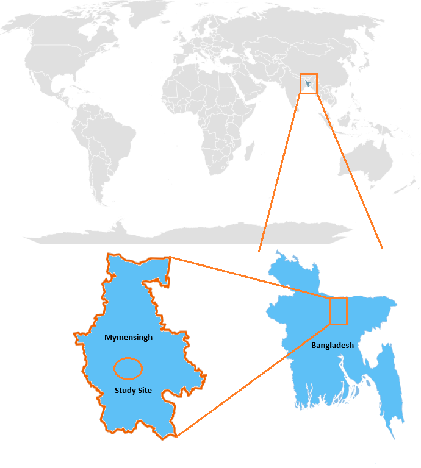
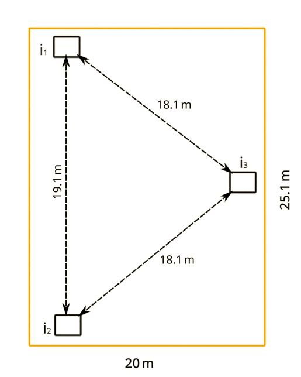
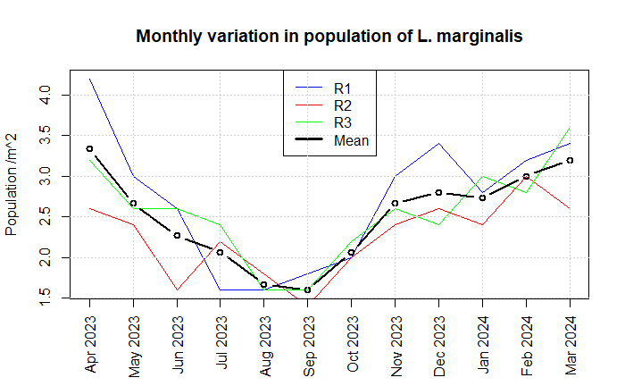
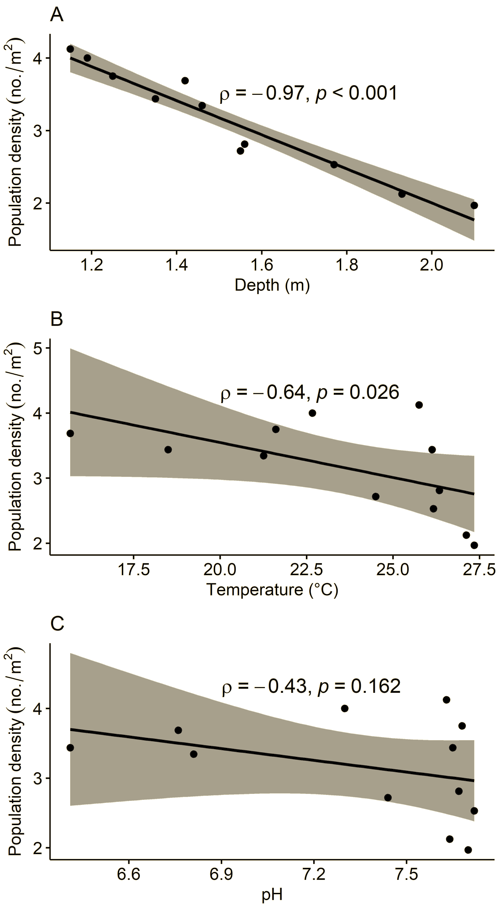

# bau-mussel-dynamics

 

### Table of contents

  * [Introduction](#introduction)
  * [Citation](#citation)
  * [Study site](#study-site)
  * [Data description](#data-description)
  * [Monthly population variation of freshwater pearl mussel](#monthly-population-variation-of-freshwater-pearl-mussel)
  * [Strong correlation between population and depth of pond](#strong-correlation-between-population-and-depth-of-pond)
  * [R notebook](#r-notebook)

### Introduction

Freshwater pearl mussel *Lamellidens marginalis* is a commercially
important aquatic species in Bangladesh. But little research has been
done about the seasonality of its yield. We conducted a year-long
study at a culture pond in Bangladesh to understand the temporal
variation of mussel population. We used quadrat sampling method
to estimate the natural population of *L. marginalis* in the lentic habitat.
Thereby, we tried to establish the months of minimum and maximum mussel yields.
Simultaneously, we recorded a few water quality parameters to assess their
impacts on mussel growth.

Our collected data of mussel samples, their biometric measurements, and
concomitant water quality parameters are released via this GitHub repository.
Moreover, we made all our R codes available here to facilitate future
fisheries management research.

Webpage: https://ff-usa.github.io/bau-mussel-dynamics/

### Citation

If you use this data, please cite as below:

Fouzia Fariha, Tashrif Billah, Bishjiet Chandro, Md. Masud Rana, Md. Jasim Uddin, Freshwater pearl mussel population dynamics data by Bangladesh Agricultural University, 2024, DOI: 10.5281/zenodo.14996734

---

### Study site

Study site in Mymensingh, Bangladesh. Map was generated using Microsoft Excel, Microsoft Paint, and OpenStreetMap (https://www.openstreetmap.org/copyright)

Culture pond and quadrats

---

### Data description

Collected data have been made available in three files:

* population.csv
* water-quality.csv
* shell-biometrics.csv

Each file spans over April 2023-March 2024, the sampling period.
There is a `Month` column in each file. Other columns and their
units are noted below:

| File | Columns | Unit | Description |
| - | - | - | - |
| population.csv | i1, i2, i3 | | Number of mussels sampled in quadrats i1, i2, i3 |
| water-quality.csv | Depth | meter | Average depth of three quadrats |
| water-quality.csv | Temperature | °C | Temperature of pond water |
| water-quality.csv | pH | | pH of pond water |
| biometrics.csv | Length, width, height | millimeter | Average dimensions of sampled mussels |

### Monthly population variation of freshwater pearl mussel

Population density is minimum in September and maximum in April.

---

### Strong correlation between population and depth of pond

p<0.001 indicates significant correlation.

### R notebook

Detailed data analysis can be found in the following notebook:

https://ff-usa.github.io/bau-mussel-dynamics/mussel.html
