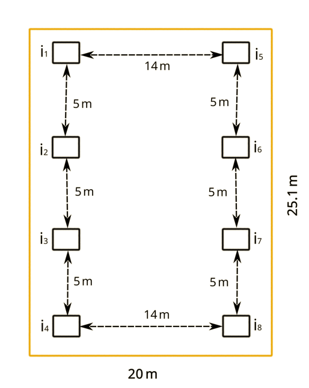
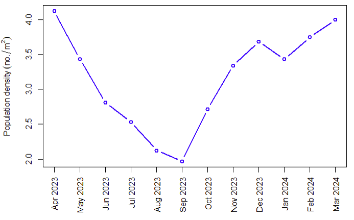

# bau-mussel-dynamics

 

### Table of contents

  * [Description](#description)
  * [Citation](#citation)
  * [Study site](#study-site)
  * [Monthly population variation of freshwater pearl mussel](#monthly-population-variation-of-freshwater-pearl-mussel)
  * [Strong correlation between population and depth of pond](#strong-correlation-between-population-and-depth-of-pond)
  * [Normality of shell dimensions](#normality-of-shell-dimensions)

### Description

(This webpage will be completed after finalizing the manuscript)

Webpage: https://ff-usa.github.io/bau-mussel-dynamics/

### Citation

If you use this data, please cite as below:

Fouzia Fariha, Tashrif Billah, Bishjiet Chandro, Md. Masud Rana, Md. Jasim Uddin, Freshwater pearl mussel population dynamics data by Bangladesh Agricultural University, 2024, DOI: 10.5281/zenodo.14996735

---

### Study site

Study site in Mymensingh, Bangladesh. Map was generated using Microsoft Excel, Microsoft Paint, and OpenStreetMap (https://www.openstreetmap.org/copyright)

Culture pond and quadrats

---

### Monthly population variation of freshwater pearl mussel

Population density is minimum in September and maximum in April.

---

### Strong correlation between population and depth of pond

p<0.05 indicates significant correlation.

---

### Normality of shell dimensions

The Shapiro-Wilk test statistics is W = 0.95837, p = 0.7603. The Q-Q plot and p>0.05 indicate normal distribution.
